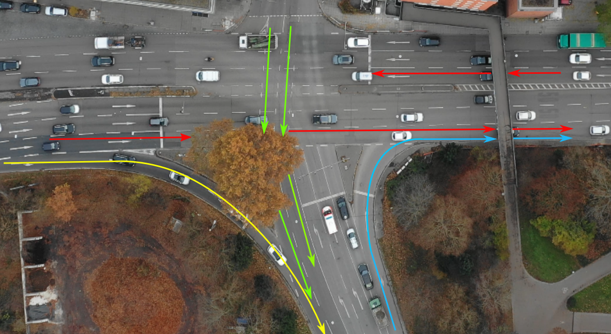

# LMB Tracker
A part of the code is based on https://github.com/jonatanolofsson/lmb.  
This repository provides a python implementation of the Labeled Multi-Bernoulli Filter for Multiple Vehicle Tracking using drone-based data in a traffic intersections with high traffic volumes. The goal of this repository is to design a method combining short tracklets together in oder to correctly track temporarily occluded vehicles. This method offers a path estimation of each vehicle under the occlusion. Using the estimated length to match tracklets correctly. 

# Performance of LMB Tracker
The LMB Tracker is tested on more than 100 trajectories and 90% are correctly matched. 
For linear matching the estimated path length has an estimation error of maximal 0.31m and for a cicular arc matching the estimation error reaches maximal 2.8m.
The details and theories of this project are explained in the master thesis Masterarbeit.pdf. 

### Picture of tracking scenario
 

### Tracklets matching cases
    

## Installation

### Dependencies

Install the required dependencies of the `requirements.yml`. This file can be used to directly create an environment with all required dependencies installed (e.g. using conda).

### Package installation

Use the provided `setup.py` file to install the `lmb` package in the currently activated environment. This enables its usage in the example scripts or your own modules.

````
python setup.py install
````

Using the `develop` option instead of `install` creates a symbolic link towards the package and thus enables continuous development without having to reinstall the package after changes.
